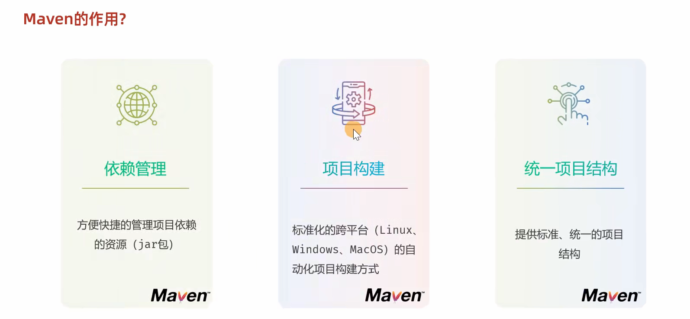
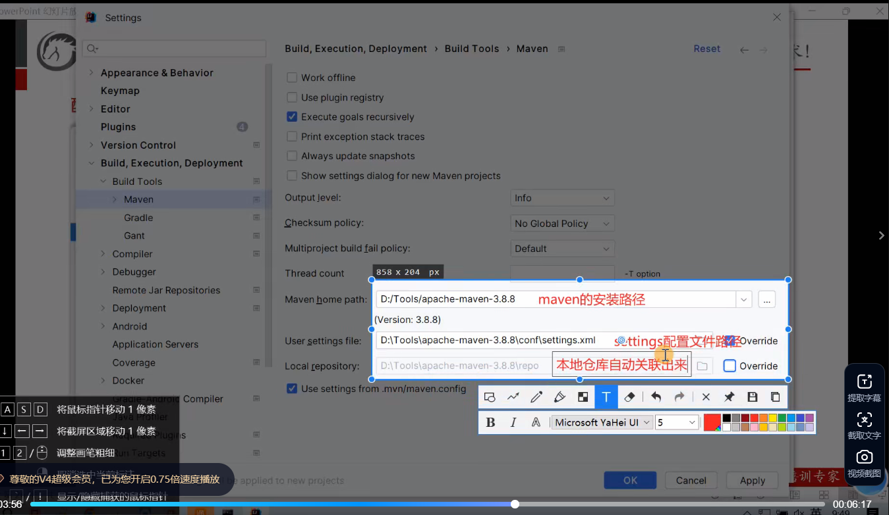
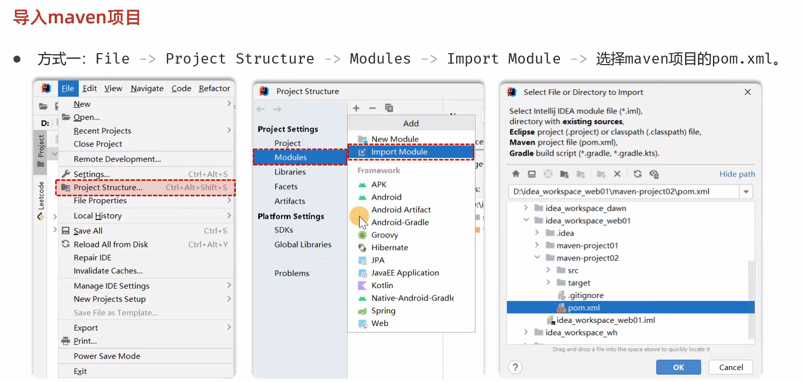

# maven的使用
## maven的作用

## 配置maven

步骤3阿里云私服的配置：

步骤4 JDK的配置方式

## 在IDE中配置maven

除此之外，还要配置File encoding中的编码为UTF-8、java compiler中的JDK版本。

## maven坐标

如果不知道依赖的坐标信息，可以到

## 导入别人的maven项目

>此方案需先将maven拉取到project的目录下。

