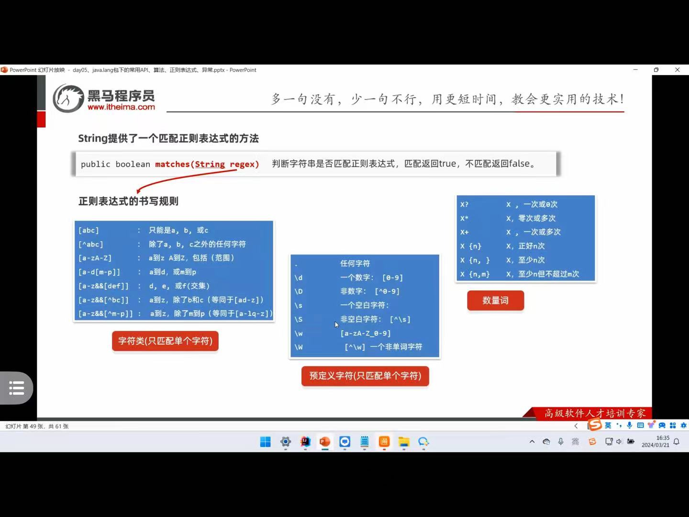
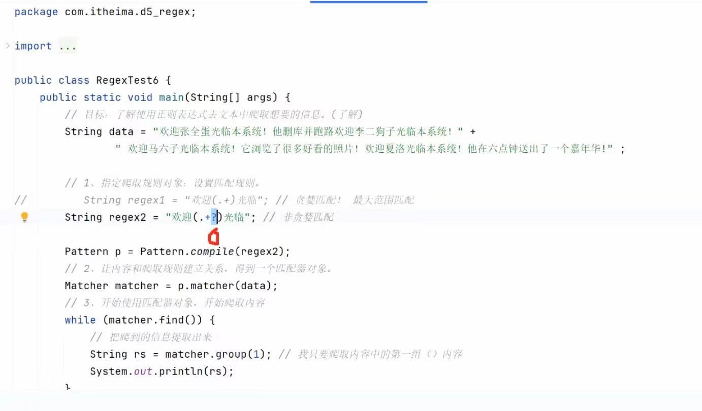

# 一些常用的API
## 1 了解StringBuilder
### 1.1 了解其常用方法
``` java
package com.liyinghuang.StringBuliderDemo1;

public class demo1 {
    public static void main(String []args){
        StringBuilder sb=new StringBuilder("12");
        //字符串的拼接
        sb.append("345");
        System.out.println(sb);
        //字符串的反转
        sb.reverse();
        System.out.println(sb);
        //计算字符串的长度
        System.out.println(sb.length());
        //把StringBulider对象转换成String对象
        //StringBuilder是拼接字符串的手段
        //String是开发中的目的
        String result=sb.toString();
        System.out.println(result);
    }
}
```
>建议：对于字符串操作，如果频繁进行拼接、修改等操作，先使用StringBuilder，不然一般使用String。原因如下：
### 1.2 StringBuilder案例
```java
package com.liyinghuang.StringBuliderDemo1;

public class demo2 {
    public static void main(String[] args){
        int []arr={1,2,3};
        System.out.println(getArrayData(arr));
    }
    public static String getArrayData(int []arr){
        if(arr==null)return null;
        StringBuilder sb=new StringBuilder();
        sb.append("[");
        for (int i = 0; i < arr.length; i++) {
            sb.append(arr[i]).append(i==arr.length-1?"":", ");
        }
        sb.append("]");
        return sb.toString();
    }
}
```
## 2、了解StringJoiner
>JDK8 后面才有，其相较于StringBuilder提供了更为便捷的拼接方式
```java
package com.liyinghuang.StringJoint;
import java.util.StringJoiner;
public class demo1 {
    public static void main(String[] args){
        int []arr={1,2,3};
        System.out.println(getArrayData(arr));
    }
    public static String getArrayData(int []arr){
        if(arr==null)return null;
        StringJoiner sb=new StringJoiner(", ","[","]");//参数一：间隔符 参数二：开始符号 参数三：结束符号
        for (int i = 0; i < arr.length; i++) {
            sb.add(Integer.toString(arr[i]));
        }
        return sb.toString();
    }
}
``` 
# 3、 了解System、Runtime、Math
## 3.1 System
```java
package com.liyinghuang.System_demo;
public class demo {
    public static void main(String[] args) {
        //currentTimeMillis函数，返回的是1970年1月1日 00：00：00走到此刻的毫秒值
        //用以计算代码性能
        long time=System.currentTimeMillis();
        System.out.println(time);
    }
}
```
## 3.2 Runtime
>没啥用，看看就行

## 3.3 Math
```java
package com.liyinghuang;
public class Math_demo {
    public static void main(String []args){
        //abs(double data)取绝对值
        System.out.println(Math.abs(-1));
        //ceil(double data)向上取整
        System.out.println(Math.ceil(0.1));
        //floor(double data)向下取整
        System.out.println(Math.floor(0.1));
        //round(double data)四舍五入
        System.out.println(Math.round(0.1));
        //max(int a,int b)取较大值
        System.out.println(Math.max(1, 2));
        //min(int a,int b)取较小值
        System.out.println(Math.min(1, 2));
        //pow(double a,double b)取次方
        System.out.println(Math.pow(2, 2));
        //random取随机数[0.0,1.0](包前不包后)
        System.out.println(Math.random());
    }
}
```
# 4、 了解BigDecimal
## 4.1 背景介绍
>用以解决浮点运算时，出现的结果失真问题
>下面是一个例子
```java
package com.liyinghuang.test;
public class demo {
    public static void main(String[] args) {
        System.out.println(0.1+0.2);
    }
}
```
其输出结果为：
0.30000000000000004
## 4.2 使用BigDecimal处理精度问题的例子
```java
package com.liyinghuang.BigDecimal;

import java.math.BigDecimal;

public class demo1 {
    public static void main(String[] args) {
        double a=0.1;
        double b=0.2;
        //1、把两个数据包装成BigDecimal对象
        BigDecimal a11=new BigDecimal(Double.toString(a));
        BigDecimal b11=new BigDecimal(Double.toString(b));
        //2、也可以用valueOf方法包装浮点数据成为BigDecimal对象
        BigDecimal a22 = BigDecimal.valueOf(a);
        BigDecimal b22 = BigDecimal.valueOf(b);
        //3、进行运算
        BigDecimal c1 = a11.multiply(b22);
        BigDecimal c2 = a11.divide(b22);
        BigDecimal c3 = a11.add(b22);
        BigDecimal c4 = a11.subtract(b22);
        //4、将结果转换为基本类型
        System.out.println(c3.doubleValue());
    }
}
```
## 4.3 扩展（当计算结果为非精确结果时，需进行特殊处理）
```java
package com.liyinghuang.BigDecimal;
import java.math.BigDecimal;
public class demo2 {
    public static void main(String[] args) {
        BigDecimal a11 = BigDecimal.valueOf(1);
        BigDecimal b21 = BigDecimal.valueOf(3);
        BigDecimal c=a11.divide(b21,2,BigDecimal.ROUND_HALF_UP);
        System.out.println(c.doubleValue());
    }
}
```
# 5、time包的使用
## 5.1 LocalDate的常用API（LocalTime、LocalDateTime类似）
```java
package com.liyinghuang.time_demo;
import java.time.LocalDate;
public class demo1 {
    public static void main(String[] args) {
        //目标：搞懂LocalDate的常用方法
        // 1、得到LocalData的对象：代表的是此刻日期
        LocalDate now = LocalDate.now();
        System.out.println(now);//2025-10-15
        //2、单独获取年 月 日 星期几
        System.out.println(now.getYear());//2025
        System.out.println(now.getMonth());//OCTOBER
        System.out.println(now.getDayOfMonth());//15
        System.out.println(now.getDayOfWeek());//WEDNESDAY
        // 3、把某个信息加多少
        LocalDate a=now.plusYears(2);
        LocalDate b=now.plusMonths(1);
        System.out.println(a);
        // 4、把某个信息减多少
        LocalDate c=now.minusYears(2);
        LocalDate d=now.minusMonths(1);
        System.out.println(c);
        //5、获取指定日期的LocalDate对象
        LocalDate e=LocalDate.of(2050,2,15);
        LocalDate f=LocalDate.of(2050,2,14);
        LocalDate g=LocalDate.of(2050,2,15);
        System.out.println(e);
        //6、判断两个日期是否相同、两个日期谁先谁后
        System.out.println(e.isBefore(f));
        System.out.println(e.isEqual(g));
        //7、修改日期
        LocalDate h=LocalDate.of(2050,2,15);
        LocalDate i=h.withMonth(3);
        System.out.println(h);
        System.out.println(i);
    }
}
```
>LocalDate和LocalTime可以合成LocalDateTime
```java
        //略
        //合
        LocalDate j=LocalDate.now();
        LocalTime k=LocalTime.now();
        LocalDateTime l=LocalDateTime.of(j,k);
        //分
        LocalDateTime m=LocalDateTime.now();
        LocalDate n=m.toLocalDate();
        LocalTime o=m.toLocalTime();
```
## 5.2 ZonedlId、ZonedDateTime
>ZoneId与ZonedDateTime是一种配合关系，先用ZonedlId去拿时区，再用ZonedDateTime去拿时间。
```java
package com.liyinghuang;
import java.time.ZoneId;
import java.time.ZonedDateTime;
import java.util.Set;
public class ZoneId_demo {
    public static void main(String[] args) {
        //输出计算机所在的时区
        ZoneId zoneId=ZoneId.systemDefault();
        System.out.println(zoneId);
        //获取Java支持的全部时区ID
        Set<String> zoneIdSet=ZoneId.getAvailableZoneIds();
        System.out.println(zoneIdSet);
        //把某个时区ID封装成ZoneId对象,并对其进行输出。
        ZoneId a = ZoneId.of("Asia/Shanghai");
        ZonedDateTime zdt = ZonedDateTime.now(a);
        System.out.println(zdt);
    }
}
```
## 5.3 Instant
```java
package com.liyinghuang.time_demo;
import java.time.Instant;
public class instant_demo {
    public static void main(String[] args) {
        Instant instant=Instant.now();
        System.out.println(instant.getEpochSecond());
        System.out.println(instant.getNano());
    }
}
```
输出：
>1760584345
>852180200

## 5.4 DataTimeFormatter
>对时间输出进行格式化
```java
package com.liyinghuang.time_demo;
import java.time.*;
import java.time.format.DateTimeFormatter;
public class DataTimeFormatter_demo {
    public static void main(String[] args) {
        //对时间进行格式化输出
        DateTimeFormatter dtf= DateTimeFormatter.ofPattern("yyyy年MM月dd日 HH:mm:ss EEE a");
        LocalDateTime zdt = LocalDateTime.now();
        String out =zdt.format(dtf);
        System.out.println(out);
        //解析时间
        String DateStr="2003年02月15日";
        DateTimeFormatter dtf1=DateTimeFormatter.ofPattern("yyyy年MM月dd日");
        LocalDate dt = LocalDate.parse(DateStr,dtf1);
        System.out.println(dt);
    }
}
```
## 5.5 Period Duration 
>用Period来计算LocalDate（年，月，日）之间的间隔
>用Duration计算时间间隔（时，分，秒，纳秒）
##

# 6.案例实践（高考时间）
>计算距离高考还有多少时间
```java
package com.liyinghuang;

import java.time.Duration;
import java.time.LocalDate;
import java.time.LocalDateTime;
import java.time.format.DateTimeFormatter;

public class gaokao {
    public static void main(String[] args) {
        //定义一个高考时间
        String final_time="2026-06-07 09:30:00";
        //对时间进行解析
        DateTimeFormatter d1=DateTimeFormatter.ofPattern("yyyy-MM-dd HH:mm:ss");
        LocalDateTime dateTime=LocalDateTime.parse(final_time,d1);
        //获取当前时间
        LocalDateTime localDate=LocalDateTime.now();
        //用duration计算时间差
        Duration duration= Duration.between(localDate,dateTime);
        //System.out.println(duration.toDays()+" days "+duration.toHours()+" hours "+duration.toMinutes()+" minutes");
        System.out.println(duration.toDays()+" days "+duration.toHoursPart()+" hours "+duration.toMinutesPart()+" minutes");
    }
}

```
# 5、Arrays类
## 5.1 Arrays的常见方法
```java
package com.liyinghuang.Arrays_demo;
import java.util.Arrays;
import java.util.function.IntToDoubleFunction;
import java.util.function.IntUnaryOperator;
public class demo1 {
    public static void main(String[] args) {
        //目标：掌握操作数组的工具类:Arrays的常见方法
        //1、返回数组的内容
        int []arr={11,22,33,44};
        System.out.println(arr);//返回一个地址
        System.out.println("1:"+Arrays.toString(arr));
        //2、拷贝数组的内容到一个新的数组，并返回新数组
        int[] arr1 = Arrays.copyOfRange(arr,1, 3);
        System.out.println("2:"+Arrays.toString(arr1));
        //3、给数组进行扩容
        int[] arr2 = Arrays.copyOf(arr, 10);
        System.out.println("3:"+Arrays.toString(arr2));
        //4、修改数组中的每个数据，再存入
        int[] arr3 = {99,88,100,58};
        Arrays.setAll(arr3,new IntUnaryOperator(){
            @Override
            public int applyAsInt(int operand) {
                return arr3[operand]+10;
            }
        });
        System.out.println("4:"+Arrays.toString(arr3));
        //5、Arrays类提供的对数组进行排序的操作
        Arrays.sort(arr3);
        System.out.println("5:"+Arrays.toString(arr3));
    }
}
```
## 5.2 Arrays的排序(主要涉及自定义排序规则)
>自定义排序规则一：让对象所在类实现比较规则接口，重写compareTo方法，来指定比较规则
>自定义排序方法二：sort方法存在重载的方法，支持自带Comparator比较器对象来直接指定比较规则
### 5.2.1 方法一：在类内定义比较方法
>下面为Student_Class类
```java
package com.liyinghuang.Arrays_demo;

public class Student_Class implements Comparable<Student_Class>{
    String name;
    int age;
    public Student_Class() {
    }

    public Student_Class(int age, String name) {
        this.age = age;
        this.name = name;
    }

    public int getAge() {
        return age;
    }

    public void setAge(int age) {
        this.age = age;
    }

    public String getName() {
        return name;
    }

    public void setName(String name) {
        this.name = name;
    }
    @Override
    public int compareTo(Student_Class o){
        /*
        * 官方规定：
        * 如果认为左边大于右边请返回正整数
        * 如果认为左边小于右边请返回负整数
        * */

        /*
        照此规定，其会返回一个升序序列
        * */
        return this.age-o.age;
    }
    public String toString() {
        return "Student_Class{" + "age=" + age + ", name=" + name + '}'+'\n';
    }
}

```
>下面为主函数所在位置
```java
package com.liyinghuang.Arrays_demo;
import java.util.Arrays;
public class demo2 {
    public static void main(String[] args) {
        Student_Class a=new Student_Class(25,"a");
        Student_Class b=new Student_Class(16,"b");
        Student_Class c=new Student_Class(34,"c");
        Student_Class d=new Student_Class(17,"d");
        Student_Class e=new Student_Class(41,"e");
        Student_Class[] students= {a,b,c,d,e};
        Arrays.sort(students);
        System.out.println(Arrays.toString(students));
    }
}
```
### 5.2.2 方法二：对sort的方法进行重载
```java
package com.liyinghuang.Arrays_demo;
import java.util.Arrays;
import java.util.Comparator;
public class demo3 {
    public static void main(String[] args) {
        Student_Class a=new Student_Class(25,"a");
        Student_Class b=new Student_Class(16,"b");
        Student_Class c=new Student_Class(34,"c");
        Student_Class d=new Student_Class(17,"d");
        Student_Class e=new Student_Class(41,"e");
        Student_Class[] students= {a,b,c,d,e};
        Arrays.sort(students,new Comparator<Student_Class>(){
            @Override
            public int compare(Student_Class o1, Student_Class o2) {
                return o1.age-o2.age;
            }
        });
        System.out.println(Arrays.toString(students));
    }
}
```
# 6. Lambda表达式
## 6.1 Lambda表达式的作用
>作用：用于简化匿名内部类的代码的写法
>注意：Lambda表达式只能简化==函数式接口的匿名内部类==。
>那什么是匿名内部类？所谓的匿名内部类是一种特殊的局部内部类，所谓匿名：指的是程序员不需要对这个类声明名字。
>那什么是函数式接口？函数式接口中有且仅有一个抽象方法。
>具体见下面的例子。
```java
package com.liyinghuang.lambda_demo;

public class demo1 {
    public static void main(String[] args) {
        //未简化的时候
        Swimming s1=new Swimming() {
            @Override
            public void swim() {
                System.out.println("学生游泳快");
            }
        };
        s1.swim();
        Swimming s2=new Swimming(){
            @Override
            public void swim() {
                System.out.println("老师游泳快");
            }
        };
        s2.swim();
        //简化的时候：new关键字，接口名，重写函数的操作都可以删掉
        Swimming s3=()->{
            System.out.println("黄祥安游泳快");
        };
        s3.swim();
    }
}

interface Swimming{
    void swim();
}
```
## 6.2 用Lambda表达式简化代码的例子
```java
package com.liyinghuang.Arrays_demo;

import java.util.Arrays;
import java.util.Comparator;
import java.util.function.IntUnaryOperator;

public class demo4 {
    public static void main(String[] args) {
        Student_Class a=new Student_Class(25,"a");
        Student_Class b=new Student_Class(16,"b");
        Student_Class c=new Student_Class(34,"c");
        Student_Class d=new Student_Class(17,"d");
        Student_Class e=new Student_Class(41,"e");
        Student_Class[] students= {a,b,c,d,e};
        Arrays.sort(students,new Comparator<Student_Class>(){
            @Override
            public int compare(Student_Class o1, Student_Class o2) {
                return o1.age-o2.age;
            }
        });
        System.out.println(Arrays.toString(students));
        Arrays.sort(students,(Student_Class o1, Student_Class o2)-> {
                return o1.age-o2.age;
        });
        System.out.println(Arrays.toString(students));
        System.out.println("---------------------------------------------");
        int[] arr3 = {99,88,100,58};
        Arrays.setAll(arr3,new IntUnaryOperator(){
            @Override
            public int applyAsInt(int operand) {
                return arr3[operand]+10;
            }
        });
        System.out.println("4:"+Arrays.toString(arr3));
        int[] arr4 = {99,88,100,58};
        Arrays.setAll(arr4, (int operand)-> {
                return arr4[operand]+10;
        });
        System.out.println("4:"+Arrays.toString(arr4));
    }
}
```
## 6.3 进一步省略Lambda表达式的写法
1、==参数类型可以省略不写==
2、==如果只有一个参数==，参数类型可以省略，同时()也可以省略
3、如果Lambda表达式的==方法体只有一行代码==，可以省略大括号。如果这行代码是return语句，也必须去掉return不写。

# 7.方法引用（比较偏）
>对Lambda表达式来进一步简洁
## 7.1 静态方法引用
>格式：“类型::静态方法”
>使用场景：如果Lambda表达式只是调用一个方法，而且前后参数形式一致，就可以使用静态方法引用
## 7.2 实例方法引用
>格式:“对象名::实例方法”
>使用场景：如果某个lambda表达式只是调用一个实例方法，并且前后参数的形式一致，就可以使用实例方法引用。
## 7.3 特定类型的方法引用
>如果某个Lambda表达式里只是调用一个实例方法，并且前面参数列表中的第一个参数是作为方法的主调，后面的所有参数都是作为该实例方法的入参的，则此时就可以使用特定类型的方法引用
## 7.4 构造器的引用
>格式“类型::new”
>适用场景:如果==某个Lambda表达式只是在创建对象==，并且前后参数一致，就可以使用构造器引用。
```java
package com.liyinghuang.lambda_demo;

public class demo4 {
    public static void main(String[] args) {
//        createCar A=new createCar() {
//            @Override
//            public Car createCar(String name) {
//                return new Car(name);
//            }
//        };
        createCar A=name->new Car(name);
        Car a=A.createCar("布加迪威龙");
        System.out.println(a.toString());
        //上面代码等价于下面代码
        createCar B=Car::new;//构造器的引用
        Car b=B.createCar("兰博基尼");
        System.out.println(b.toString());
    }
}
@FunctionalInterface
interface createCar{//函数式接口
    Car createCar(String name);
}
class Car{
    private String name;
    public Car() {
    }
    public Car(String name) {
        this.name = name;
    }

    public String getName() {
        return name;
    }

    public void setName(String name) {
        this.name = name;
    }
    @Override
    public String toString() {
        return ("车名为:"+this.name);
    }
}
```
# 8.算法
## 8.1 排序算法
### 8.1.1 冒泡排序
```java
package com.liyinghuang.algorithm;
import java.util.Arrays;
public class BubbleSort {
    public static void main(String[] args) {
        //任务：完成冒牌排序算法
        //1、定义一个数组
        int []arr={5,2,3,1};//3次
        //2、进行排序
        //i   j     j的站位
        //0   2<3   0 1 2
        //1   1<2   0 1
        //2   0<1   0
        for(int i=0;i<arr.length-1;i++){
            for(int j=0;j<arr.length-i-1;j++){
                //进行升序排序
                if(arr[j]>arr[j+1]){
                    int temp=arr[j];
                    arr[j]=arr[j+1];
                    arr[j+1]=temp;
                }
            }
        }
        System.out.println(Arrays.toString(arr));
    }
}
```
### 8.1.2 选择排序
>每轮从后往前依次选择位置，从当前位置开始向后遍历，如果遇到有的值比较小，那么就进行swap操作(升序排序)。
```java
package com.liyinghuang.algorithm;
import java.util.Arrays;
public class SelectSort {
    public static void main(String[] args) {
        //1、定义一个数组
        int[] a={5,1,3,2};
        //2、进行模拟推理
        // i         j
        // 0  1,2,3  1
        // 1  2,3    2
        // 2  3      3
        for(int i=0;i<a.length-1;i++){
            for(int j=i+1;j<a.length;j++){
                if(a[i]>a[j]){
                    int temp=a[j];
                    a[j]=a[i];
                    a[i]=temp;
                }
            }
        }
        System.out.println(Arrays.toString(a));
    }
}
```
## 8.2 查找算法
### 8.2.1 二分查找算法
>前提：数组必须有序
```java
package com.liyinghuang.algorithm;
public class demo1 {
    public static void main(String[] args) {
        //实现二分查找
        int []arr={7,23,79,81,103,127,131,147};
        int index=searchDataIndex(arr,23);
        System.out.println(index);
    }
    private static int searchDataIndex(int[] arr, int i) {
        //1、定义左右指针
        int left=0;
        int right=arr.length-1;
        while(left<=right){
            int mid=(left+right)/2;
            if(arr[mid]==i){
                return mid;
            }
            else if(arr[mid]>i){
                right=mid-1;
            }
            else{
                left=mid+1;
            }
        }
        return -1;
    }
}
```

# 9.正则表达式
## 9.1 正则表达式
作用：
1. 用来检验数据格式是否合法
2. 在一段文本中查找满足要求的内容
>String提供了一个匹配正则表达式的方法(==matchs(String regex)==)
其中常见的语法:
1. 常见语如下：
2. 其它几个常用的符号：(?i)忽略大小写、或：|、分组：()
## 9.2 正则表达式案例
### 9.2.1 检验手机号是否合理？
```java
package com.liyinghuang.algorithm;
import java.util.Scanner;
public class check_demo {
    public static void main(String[] args) {
        check_phone();
    }
    private static void check_phone() {
        Scanner sc=new Scanner(System.in);
        System.out.println("请输入您的手机号码：");
        String phone=sc.next();
        if(phone.matches("1[3-9]\\d{9}")) {
            System.out.println("您输入的手机号码正确！");
        }
        else{
            System.out.println("您输入的手机号码有误！");
        }
    }
}
```
### 9.2.2 从String中提取有需要的信息
```java
package com.liyinghuang.algorithm;
import java.util.regex.Matcher;
import java.util.regex.Pattern;
public class demo2 {
    public static void main(String[] args) {
        // 目标：从数据中提取出电话号码和邮箱地址。
        String data = "来源程序序码学习Java,\n" +
                "电话：18512516758、18512589097\n" +
                "热线电话：400-618-9090、400-618-4000\n" ;
        // 需求：手机号码和400号码。
        // 定义正则表达式
        Pattern pattern = Pattern.compile("1[3-9]\\d{9}|400-\\d{3}-\\d{4}");
        // 创建Matcher对象,用于在data字符串中查找与正则表达式匹配的内容。
        Matcher matcher = pattern.matcher(data);
        while (matcher.find()) {//使用matcher.find()方法在data字符串中查找与正则表达式匹配的内容。
            String info = matcher.group();//每次找到匹配项时，使用matcher.group()方法获取匹配的字符串。
            System.out.println(info);
        }
    }
}
```
### 9.2.3 利用==组别机制==来对获取到的信息作进一步提取
>从String中提取电话号码的后9位
```java
package com.liyinghuang.algorithm;
import java.util.regex.Matcher;
import java.util.regex.Pattern;
public class demo2 {
    public static void main(String[] args) {
        // 目标：从数据中提取出电话号码和邮箱地址。
        String data = "来源程序序码学习Java,\n" +
                "电话：18512516758、18512589097\n" +
                "热线电话：400-618-9090、400-618-4000\n" ;
        // 需求：手机号码和400号码。
        Pattern pattern = Pattern.compile("1[3-9](\\d{9})");
        Matcher matcher = pattern.matcher(data);
        while (matcher.find()) {
            String info = matcher.group(1);
            System.out.println(info);
        }
    }
}
```
>上面代码中Pattern.compile()的括号中在定义()来确认组别，上面代码中的"(\\d{9})"是组别1。
### 9.2.4 贪婪匹配和非贪婪匹配
1. 贪婪匹配会最大范围寻找到适配字符串
2. 非贪婪匹配会最小范围寻找到适配字符串，但是要用特殊标识符"?"。


### 9.2.5 利用正则化机制来划分字符串和替换字符串
```java
package com.liyinghuang.algorithm;

public class demo3 {
    public static void main(String[] args) {
        String s1="文件嗲dewhwkjwq第二圈";
        String []strs=s1.split("\\w+");
        for (int i = 0; i < strs.length; i++) {
            System.out.println(strs[i]);
        }
        String s2=s1.replaceAll("\\w+","-");
        System.out.println(s2);
    }
}

```
