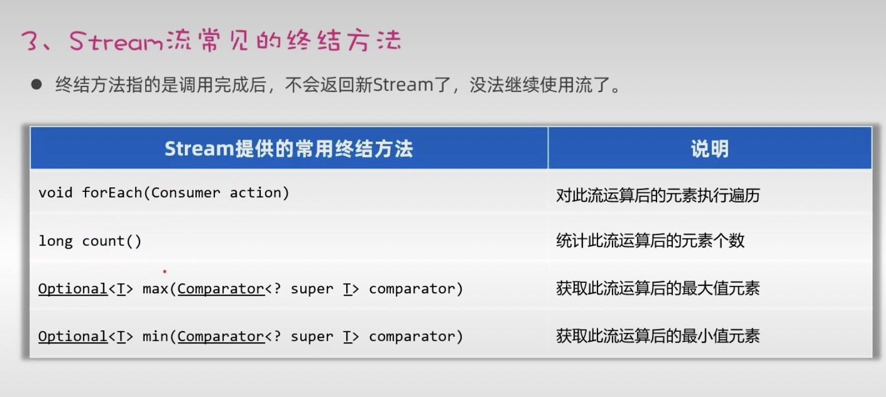
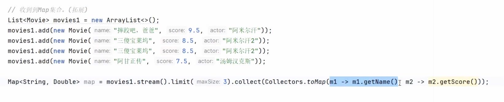

# 1.Stream流
>Stream流是简化集合、数组操作的API。
```java
package com.liyinghuang.Stream_demo;

import java.util.ArrayList;
import java.util.Comparator;
import java.util.List;
import java.util.stream.Stream;

public class demo1 {
    public static void main(String[] args) {
        //了解Stream流常见的中间方法
        //1、filter过滤器
        List<String> names=new ArrayList<>();
        names.add("ads");
        names.add("ada");
        names.add("cds");
        names.stream().filter(s->s.startsWith("a")).filter(s->s.length()==3).forEach(System.out::println);
        //2、对元素进行升序排序
        //需要重写相关类中的compareTo函数
        Student student1 = new Student("lyh",22);
        Student student2 = new Student("yp",21);
        Student student3 = new Student("hxa",20);
        Student student4 = new Student("lyh",22);
        List<Student> students = new ArrayList<>();
        students.add(student1);
        students.add(student2);
        students.add(student3);
        students.add(student4);
        System.out.println("-----------------------------------------------");
        students.stream().sorted().forEach(System.out::println);
        //完整版
        System.out.println("-----------------------------------------------");
        students.stream().sorted(new Comparator<Student>() {
            @Override
            public int compare(Student o1, Student o2) {
                return Double.compare(o2.age,o1.age);
            }
        }).forEach(System.out::println);
        //简略版
        System.out.println("-----------------------------------------------");
        students.stream().sorted((o1,o2)->Double.compare(o2.age,o1.age)).forEach(System.out::println);
        //3、跳过前几个元素
        System.out.println("-----------------------------------------------");
        students.stream().sorted().skip(3).forEach(System.out::println);
        //4、获取前几个元素
        System.out.println("-----------------------------------------------");
        students.stream().sorted().limit(2).forEach(System.out::println);
        //5、去除流中相同元素
        System.out.println("-----------------------------------------------");
        students.stream().distinct().forEach(System.out::println);
        //6、map加工方法：把流上的数据加工成新的数据
        System.out.println("-----------------------------------------------");
        students.stream().map(m->"名字："+m.getName()+"年龄："+m.getAge()).forEach(System.out::println);
        //7、合并流
        //把两个拼接起来
        Stream<String> s1=Stream.of("a","b","c");
        Stream<String> s2=Stream.of("d","e","f");
        Stream<String> s3=Stream.concat(s1,s2);
        s3.forEach(System.out::println);
    }
}`
```

# 2.Stream流常见的终结方法
>终结方法是指调用完成后，不会返回新Stream了，没法继续使用流了。


# 3.收集Stream中的进行处理完的数据
>收集到List集合（使用.collect(Collectors.toList())
>收集到Set集合（使用.collect(Collectors.toSet()）)
>收集到List集合（使用.toArray()函数）
>收集到Map双列集合

