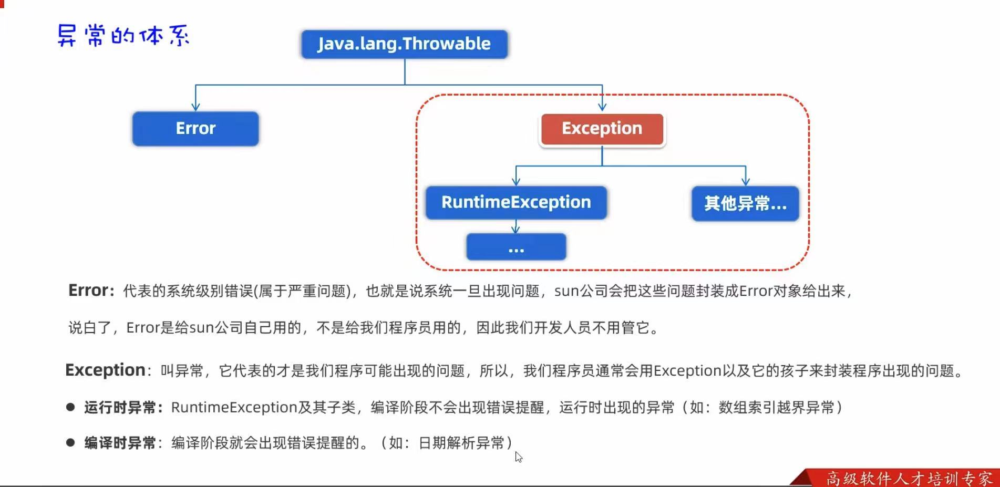
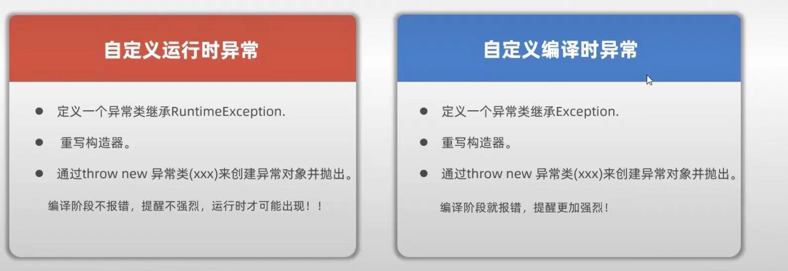

# 1. 异常的概念
>异常是代码在编译或者执行过程中可能出现的错误。


>下面是常见的异常
```java
package com.liyinghuang.demo1;

import java.util.Arrays;

public class demo1 {
    public static void main(String[] args) {
        int[]arr={1,2,3};
        //System.out.println(arr[3]);//ArrayIndexOutOfBoundsException

        String a=null;
        //System.out.println(a.length());//NullPointerException //数组索引越界异常

        //System.out.println(10/0);//ArithmeticException 数学操作异常

        Object b="张麻子";
        //Integer c=(Integer)b;//ClassCastException 类型转换异常
        
        String s="23a";
        int g=Integer.valueOf(s);
        System.out.println(g);//NumberFormatException 数字转换异常
    }
}

```
# 2. 异常的作用
>异常的作用如下：
1.用来查寻系统Bug的关键参考信息。
2.作为方法内部的一种特殊返回值，以便通知上层调用者底层的执行情况
```java
package com.liyinghuang.demo1;
public class demo2 {
    //了解异常的作用：作为方法内部的一种特殊返回值，以便通知上层调用者底层的执行情况
    public static void main(String[] args) {
        try {
            System.out.println(divide(10,0));
        }
        catch (Exception e) {
            System.out.println("做除法失败！");
            e.printStackTrace();
        }
    }
    public static int divide(int dividend, int divisor) {
        if(divisor == 0){
            throw new RuntimeException("/ by zero");
        }
        int result = dividend/divisor;
        return result;
    }
}
```

# 3.自定义异常


## 3.1 运行时异常的例子
step1 定义一个异常类继承RuntimeException并重写构造器
```java
package com.liyinghuang.demo1;

public class AgeIllegalRuntimeException extends RuntimeException{
    public AgeIllegalRuntimeException() {
    }
    public AgeIllegalRuntimeException(String message) {//message封装着异常的原因
        super(message);//调他爸的构造器
    }
}
```
step2 throw对象
```java
package com.liyinghuang.demo1;

public class demo3 {
    public static void main(String[] args) {
        System.out.println("---开始---");
        try {
            saveAge(16);
            System.out.println("执行成功!");
        }
        catch (Exception e) {
            e.printStackTrace();
            System.out.println("执行失败！");
        }
        System.out.println("---结束---");
    }

    private static void saveAge(int i) {
        if(i<0||i>150){
            throw new AgeIllegalRuntimeException("Age is illegal");
        }
        else {
            System.out.println("年龄保存成功："+i);
        }
    }
}
```
## 3.2 编译时异常的例子
step1 定义一个异常类继承Exception并重写构造器
```java
package com.liyinghuang.demo1;
public class AgeIllegalRuntimeException extends Exception{
    public AgeIllegalRuntimeException() {
    }
    public AgeIllegalRuntimeException(String message) {
        super(message);
    }
}
```
step2 throw对象
```java
package com.liyinghuang.demo1;

public class demo3 {
    public static void main(String[] args) {
        System.out.println("---开始---");
        try {
            saveAge(16);
            System.out.println("执行成功!");
        }
        catch (Exception e) {
            e.printStackTrace();
            System.out.println("执行失败！");
        }
        System.out.println("---结束---");
    }

    private static void saveAge(int i) throws AgeIllegalRuntimeException {
        if(i<0||i>150){
            throw new AgeIllegalRuntimeException("Age is illegal");
        }
        else {
            System.out.println("年龄保存成功："+i);
        }
    }
}
```
# 4.对于异常的处理
1、捕获异常，并将其返回给用户
2、尝试修复
>输入"ctr+alt+T"快捷建立"Surround with"，对此可以快速构建"try-catch"结构。