# 1.集合体系架构

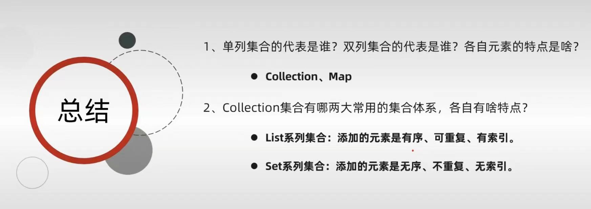
其中Collection的结构如下所示：
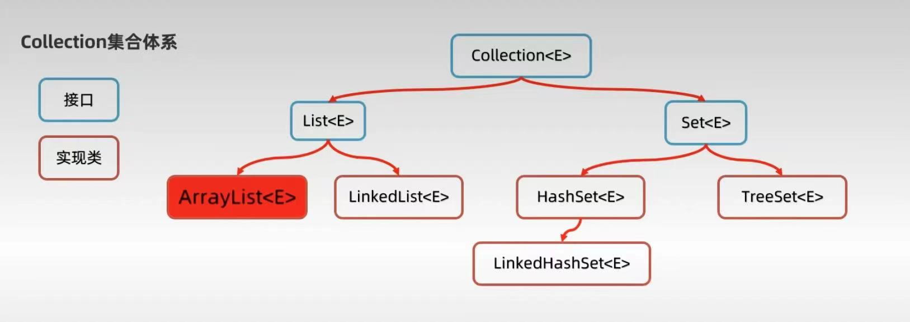

# 2.Collection的方法
```java
package com.liyinghuang.setDemo;
import java.util.ArrayList;
import java.util.Arrays;
import java.util.Collection;
public class demo1 {
    public static void main(String[] args) {
        Collection list = new ArrayList<>();
        // 1、对其添加数据
        list.add(1);
        list.add(1);
        list.add(2);
        list.add(3);
        list.add("ggbond");
        System.out.println(list);
//        //2、清空集合
//        list.clear();
//        System.out.println(list);
//        //3、判断是否为空？
//        System.out.println(list.isEmpty());
        //4、直接删除集合中的某个数据：默认只能删除第一个
        System.out.println(list.remove(1));
        //5、判断集合中是否包含某个元素
        System.out.println(list.contains(1));
        //6、把集合转换为数组
        Object[] array = list.toArray();
        System.out.println(Arrays.toString(array));

        //7、把别人的数据弄到自己身上
        Collection list1 = new ArrayList<>();
        list1.add(1);
        list1.add(1);
        Collection list2 = new ArrayList<>();
        list2.add(2);
        list2.add(2);
        list1.addAll(list2);
        System.out.println(list1);
    }
}
```
>扩展：将字符串集合转换为字符串数组的方法
```java
package com.liyinghuang.setDemo;
import java.util.ArrayList;
import java.util.Arrays;
import java.util.Collection;
public class demo2 {
    public static void main(String[] args) {
        Collection <String>collection=new ArrayList();
        collection.add("aaaa");
        collection.add("bbbb");
        String[] names = collection.toArray(String[]::new);
        System.out.println(Arrays.toString(names));
    }
}
```
# 3.Collection的遍历方式
# 3.1 迭代器遍历法
>迭代器是用来遍历集合的专用方式（数组是没有迭代器的），JAVA中迭代器的代表是Iterator。
```java
package com.liyinghuang.setDemo;

import java.util.ArrayList;
import java.util.Collection;
import java.util.Iterator;

public class demo3 {
    public static void main(String[] args) {
        ArrayList<String> arr=new ArrayList();
        arr.add("aaaa");
        arr.add("bbbb");
        arr.add("cccc");
        Iterator<String> iterator=arr.iterator();
        while (iterator.hasNext()){
            String str=iterator.next();
            System.out.println(str);
        }
    }
}
```
# 3.2 增强for循环
>增强for循环可以遍历集合或者数组
>增强for循环遍历数组本质就是迭代器遍历集合的简要写法
```java
package com.liyinghuang.setDemo;

import java.util.ArrayList;
import java.util.Collection;
import java.util.Iterator;

public class demo3 {
    public static void main(String[] args) {
        ArrayList<String> arr=new ArrayList();
        arr.add("aaaa");
        arr.add("bbbb");
        arr.add("cccc");
        Iterator<String> iterator=arr.iterator();
        for (String s : arr) {
            System.out.println(s);
        }
    }
}
```
# 3.3 Lambda简化式
```java
package com.liyinghuang.setDemo;

import java.util.ArrayList;
import java.util.Iterator;
import java.util.function.Consumer;

public class demo4 {
    public static void main(String[] args) {
        ArrayList<String> arr=new ArrayList();
        arr.add("aaaa");
        arr.add("bbbb");
        arr.add("cccc");
        Iterator<String> iterator=arr.iterator();
        arr.forEach(s->System.out.println(s));
    }
}
```

# 4.集合的并发修改异常
>在使用迭代器遍历集合时，又在删除集合中的数据，程序就会持续爱你并发修改异常的错误。
```java
package com.liyinghuang.setDemo;

import java.util.ArrayList;
import java.util.Iterator;

public class demo5 {
    public static void main(String[] args) {
        ArrayList<String> arr=new ArrayList();
        arr.add("aaaa");
        arr.add("bbbb");
        arr.add("accc");
        //1、使用迭代器遍历并进行删除
        Iterator<String> iterator=arr.iterator();
        while (iterator.hasNext()){
            String s=iterator.next();
            if(s.contains("a")){
                iterator.remove();//这个方法是迭代器自带的删除法。
            }
        }
        System.out.println(arr);
    }
}

```


# 5.List特有的方法
>ArrayList与LinkedList的异同：
同：有序，可重复，有索引
异：其底层实现逻辑不同

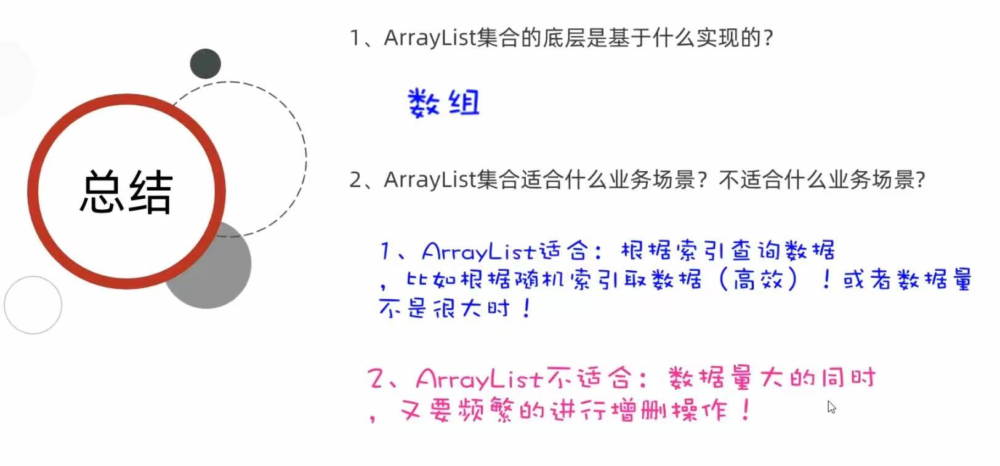

## 5.1 ArrayList
>其特有的方法基本和“下标”有关！
```java
package com.liyinghuang.setDemo;
import java.util.ArrayList;
import java.util.List;
public class demo6 {
    public static void main(String[] args) {
        // 1、声明并初始化
        List list=new ArrayList();
        list.add("aaa");
        list.add("bbb");
        list.add("ccc");
        //System.out.println(list);//[aaa, bbb, ccc]
        //2、 在某个位置插入元素
        list.add(1,"ddd");
        System.out.println(list);//[aaa, ddd, bbb, ccc]
        //3、根据索引删除元素
        list.remove(1);
        System.out.println(list);
        //4、修改索引位置的元素
        list.set(0,"eee");
        System.out.println(list);
        //5、根据索引取数据
        System.out.println(list.get(0));
    }
}
```
>ArrayList作为Collection的子类，其功能相较于父类有一定的扩展
其可以用for循环进行遍历
```java
package com.liyinghuang.setDemo;

import java.util.ArrayList;
import java.util.List;

public class demo6 {
    public static void main(String[] args) {
        List list=new ArrayList();
        list.add("aaa");
        list.add("bbb");
        list.add("ccc");
        System.out.println(list.get(0));
        for (int i = 0; i < list.size(); i++) {
            System.out.println(list.get(i));
        }
    }
}
```
## 5.2 LinkedList
>其新增了许多对首尾进行操作的方法
### 5.2.1 LinkedList的应用场景
1. 可以用来设计栈
2. 可以用来设计队列
   
# 6.自定义单链表
>定义单链表对象
```java
package com.liyinghuang.setDemo;

import java.util.StringJoiner;

public class MyLinkedList <E>{
    private int size= 0;
    //定义节点
    public static class Node<E>{
        E data;
        Node<E> next;
        public Node(E data, Node<E> next) {
            this.data = data;
            this.next = next;
        }
    }
    //定义一个头指针
    MyLinkedList.Node<E> head;

    @Override
    public String toString() {
        StringJoiner sj = new StringJoiner(",","[","]");
        Node<E> temp=head;
        while (temp!=null){
            sj.add(temp.data.toString());
            temp=temp.next;
        }
        return sj.toString();
    }

    public boolean add(E data){
        //要考虑当前插入的节点是不是头结点
        if(head==null){
            head=new MyLinkedList.Node<E>(data,null);
        }
        else{//在链表的尾部进行插入操作
            MyLinkedList.Node temp=head;
            while(temp.next!=null){
                temp=temp.next;
            }
            temp.next=new MyLinkedList.Node(data,null);
        }
        return true;
    }
}
```
>书写主函数
```java
package com.liyinghuang.setDemo;

public class demo7 {
    public static void main(String[] args) {
        MyLinkedList myLinkedList=new MyLinkedList();
        myLinkedList.add("aaa");
        myLinkedList.add("bbb");
        System.out.println(myLinkedList);
    }
}
```
# 7.Set系列的集合
>其仅仅延续了Collection中的方法，并无自己独特的方法

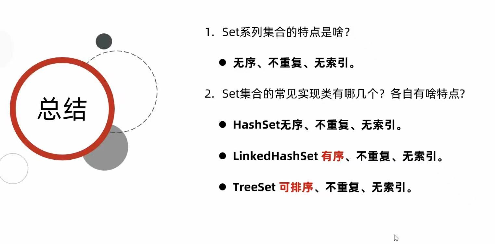

## 7.1 HashSet的底层原理
>先了解哈希值

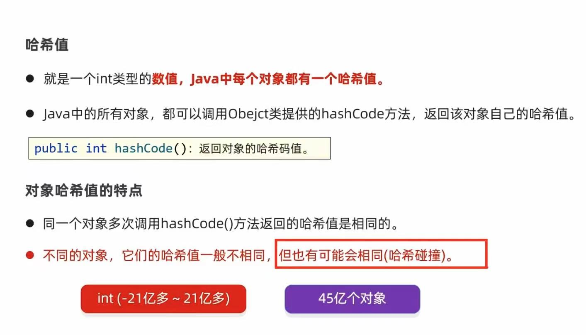
>HashSet的工作原理

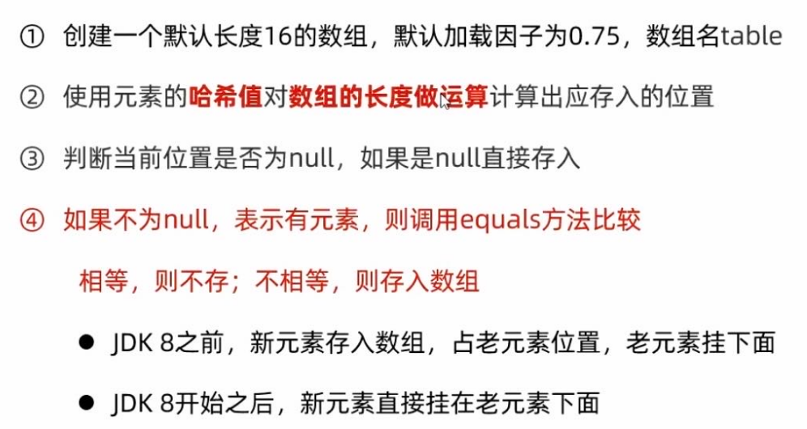
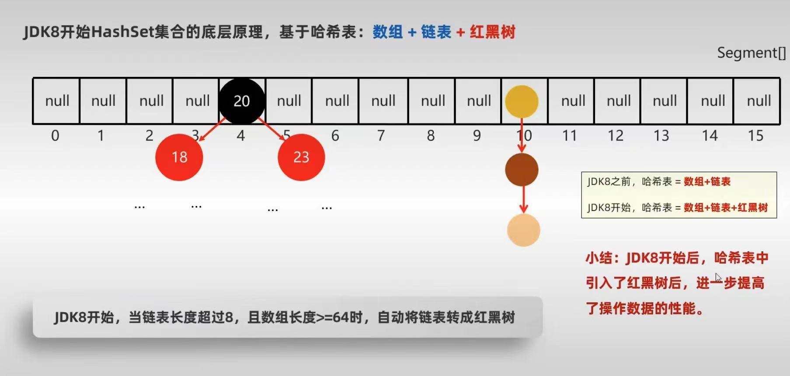

## 7.2 HashSet集合去重复的机制
>这里了解在自定义对象背景下，如何不重复存储内容相同的对象。
>基本步骤：1、重写对象中的equals。2、重写对象中的hashCode。

样例如下：
自定义一个学生类：
```java
package com.liyinghuang.setDemo;
import java.util.Objects;
public class Student {
    String name;
    int age;
    public Student() {
    }
    Student(String name, int age){
        this.name=name;
        this.age=age;
    }
    //只要两个对象的内容一样结果就是true。
    @Override
    public boolean equals(Object o) {
        if (o == null || getClass() != o.getClass()) return false;
        Student student = (Student) o;
        return age == student.age && Objects.equals(name, student.name);
    }
    //只要两者对象的内容一样，返回的哈希值就一样
    @Override
    public int hashCode() {
        return Objects.hash(name, age);
    }

    public String getName() {
        return name;
    }

    public void setName(String name) {
        this.name = name;
    }

    public int getAge() {
        return age;
    }

    public void setAge(int age) {
        this.age = age;
    }
    public String  toString(){
        return "Student [name=" + name + ", age=" + age + "]";
    }
}
```
定义主函数：
```java
package com.liyinghuang.setDemo;
import java.util.HashSet;
import java.util.Set;
public class demo8 {
    public static void main(String[] args) {
        Set<Student> Students = new HashSet<Student>();
        Student student1 = new Student("lyh",22);
        Student student2 = new Student("lyh",22);
        Student student3 = new Student("yp",22);
        Students.add(student1);
        Students.add(student2);
        Students.add(student3);
        System.out.println(Students);
    }
}
```
## 7.3 LinkedHashSet底层原理
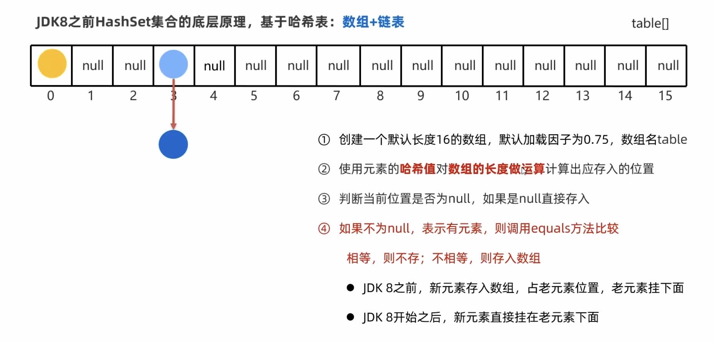

## 7.4 TreeSet
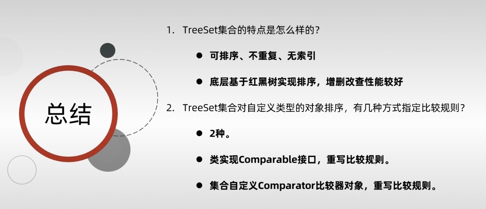
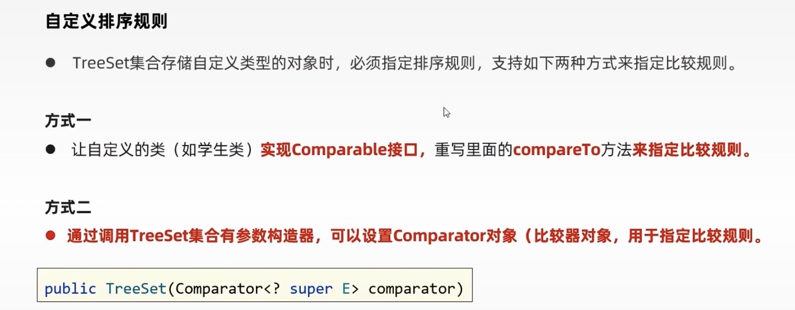
# 总结：
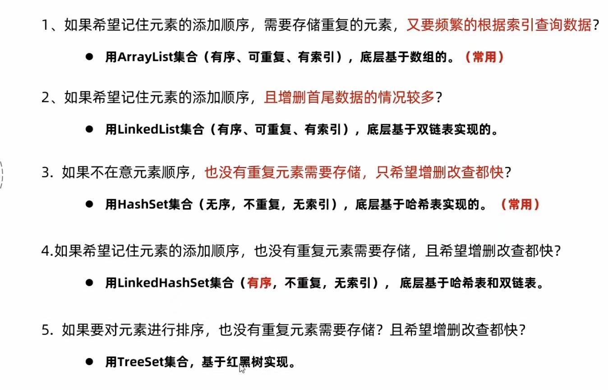